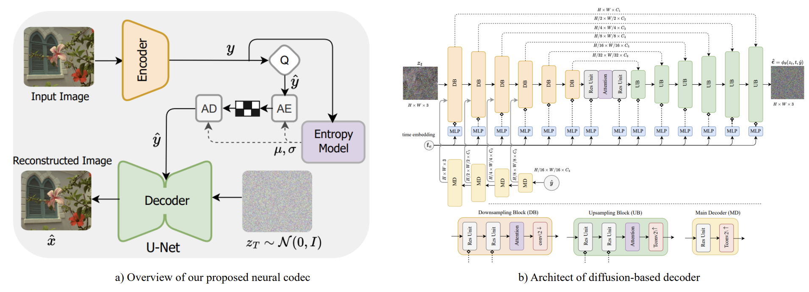
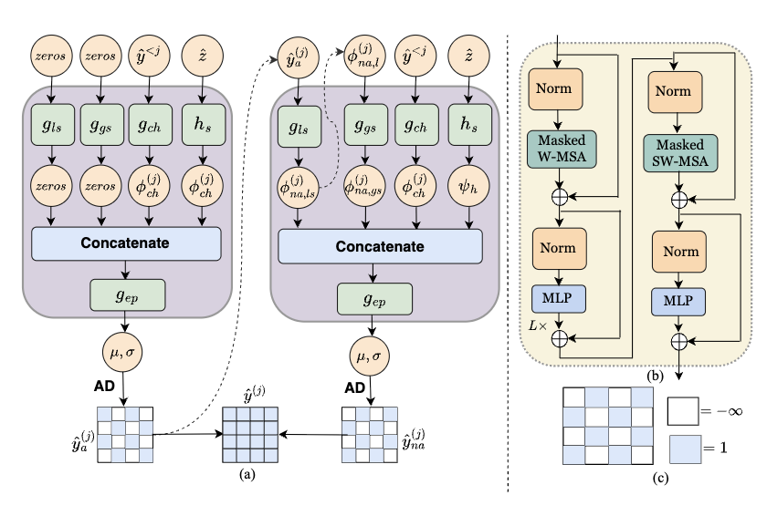

# Laplacian-guided Entropy Model in Neural Codec with Blur-dissipated Synthesis
Pytorch implementation of the paper "Laplacian-guided Entropy Model in Neural Codec with Blur-dissipated Synthesis". Accepted by CVPR2024.

----

## Abstract

While replacing Gaussian decoders with a conditional
diffusion model enhances the perceptual quality of reconstructions in neural image compression, their lack of inductive bias for image data restricts their ability to achieve state-of-the-art perceptual levels. To address this limitation, we adopt a non-isotropic diffusion model at the decoder side. This model imposes an inductive bias aimed
at distinguishing between frequency contents, thereby facilitating the generation of high-quality images. Moreover,
our framework is equipped with a novel entropy model that accurately models the probability distribution of latent representation by exploiting spatio-channel correlations in latent space, while accelerating the entropy decoding step. This channel-wise entropy model leverages both local and global spatial contexts within each channel chunk. The global spatial context is built upon the Transformer, which is specifically designed for image compression tasks. The designed Transformer employs a Laplacianshaped positional encoding, the learnable parameters of which are adaptively adjusted for each channel cluster.
Our experiments demonstrate that our proposed framework yields better perceptual quality compared to cuttingedge generative-based codecs, and the proposed entropy model contributes to notable bitrate savings.

----

## Architecture


 - The overall framework:


 - The proposed entropy model:

 <p align="center">
  
</p>

---

## Results

 <p align="center">
  
</p>


--

##  Citation

```
@inproceedings{khoshkhatinat2024laplacian,
  title     = {Laplacian-guided entropy model in neural codec with blur-dissipated synthesis},
  author    = {Khoshkhatinat, Atefeh and Zafari, Ali and Mehta, Piyush M and Nasrabadi, Nasser M},
  booktitle = {Proceedings of the IEEE/CVF Conference on Computer Vision and Pattern Recognition},
  year      = {2024}
}
```
